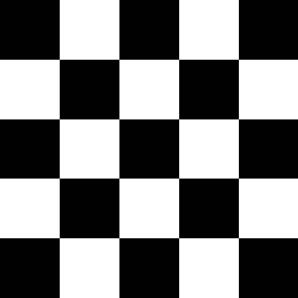
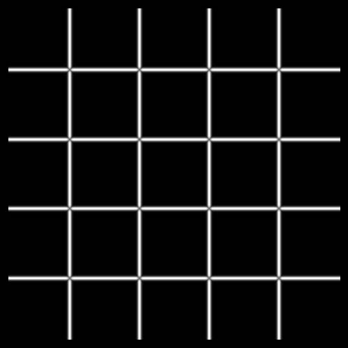
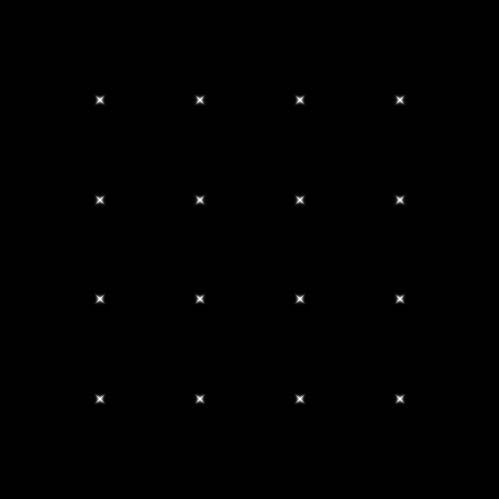
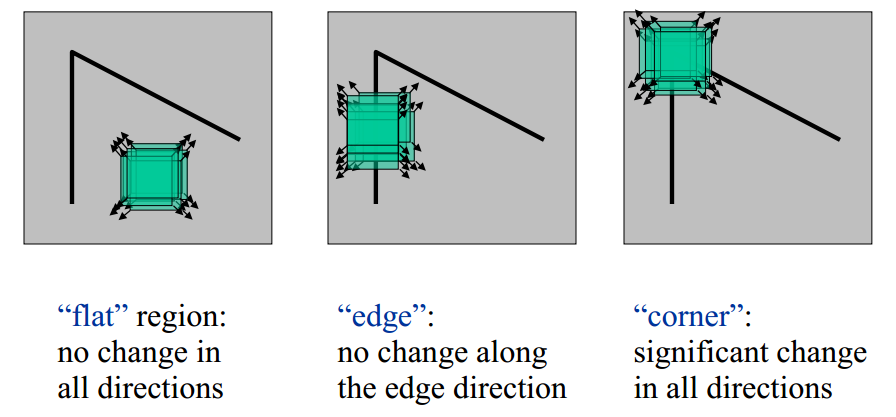
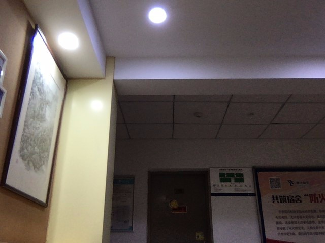
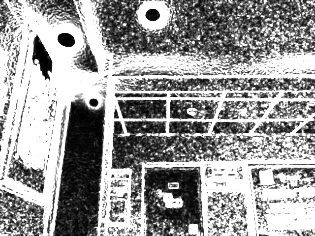
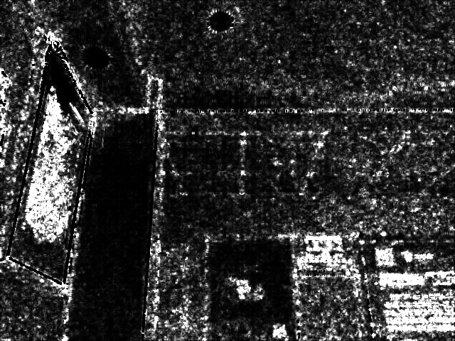
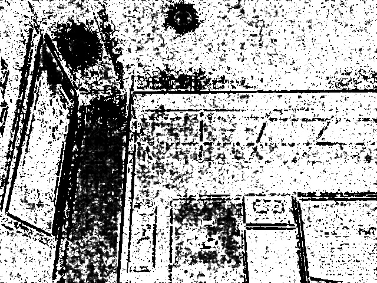
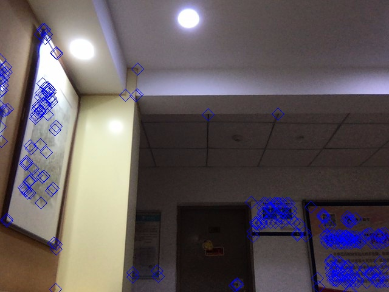

# HW# 2 Harris Corner Detection

## 作业要求

读入摄像头，回放视频。按一下空格键，则暂停回放，并将当前帧图像做一次 Harris Corner 检测 ，并将检测的结果叠加在原来图像上。

1. 需要自己写代码实现 Harris Corner 检测 算法，不能直接调用 OpenCV 里面与 Harris 角点检测相关的函数；
2. 显示中间的处理结果及最终的检测结果，包括最大特征值图、最小特征值图、R 图 （可以考虑彩色展示）、原图上叠加检测结果等，并将这些中间结果都输出保存为图像文件。

老师给的三个例子：

| 原图                      | 最大特征值图                        | 最小特征值图                        |
| ------------------------- | ----------------------------------- | ----------------------------------- | --- |
|  |  |  |     |

## 实现原理

角点（Corner）是一种重要的图像特征，表示两个边缘特征（Edges）的相交部分，在角点处，图像的梯度在各个方向变化较大。角点特征比边缘特征更好地用于定位。

Chris Harris 和 Mike Stephens 在 1988 年发表的论文 A Combined Corner and Edge Detector 提出了 Harris 角点检测算法。

图像中常见的区域有 3 种，如下图所示：

- 平坦区域：窗口在各个方向上移动，窗内像素值没有变化。
- 边缘特征：如果沿着一个方向移动，像素值会发生改变；如果沿着另一个方向移动，像素值则不会发生改变
- 角点特征：不管沿着什么方向移动，像素值都会改变。

Harris 角点检测算法的主要思想是，使一个固定尺寸的窗口在图像上某个位置以任意方向做微小滑动，如果窗口内的灰度值都有较大的变化，那么这个窗口所在的区域就存在角点。

这样 Harris 角点检测算法主要分为 3 步：

1. 窗口同时向 x 和 y 两个方向移动位移 $(u, v)$ 时，计算窗口内部的像素值变化量 $E(u, v)$
2. 对于每个窗口，计算其对应的一个角点响应函数 $R$
3. 然后对该函数进行阈值处理，如果 $R > \text{threshold}$，表示该窗口对应一个角点特征

### 灰度值变化描述

窗口 $W$ 在 $(x, y)$ 方向发生 $(u, v)$ 大小的滑动时，滑动前后窗口中的像素点灰度变化描述如下：

$$
E(u, v) = \sum_{(x, y) \in W}w(x, y)[I(x+u, y+v) - I(x, y)]^2 \tag{1}
$$

其中：

- $(x, y)$ 是窗口 $W$ 所对应的像素坐标位置，窗口有多大，就有多少个位置
- $I(x, y)$ 是坐标 $(x, y)$ 处的图像灰度值
- $w(x, y)$ 是窗口函数，最简单情况就是对 $W$ 内的所有点值都为 $1$。但有时候我们会将 $w(x, y)$ 函数设置为以窗口 $W$ 的中心为原点的二元正态分布。如果窗口 $W$ 中心点是角点时，移动前与移动后，该点在灰度变化的贡献应该是最大的，而离窗口中心较远的点，灰度变化很小，权重系数可以设定较小值，以表示对灰度值贡献较小，这样自然就想到了使用二维高斯函数来表示窗口函数。

### $E$ 的简化

直接用公式 1 计算，速度会很慢，因此使用泰勒展示进行逼近。

二维泰勒公式：

$$
f(x + u, y + v) \approx f(x, y) + uf_x(x, y) + vf_y(x, y) \tag{2}
$$

将泰勒公式应用于 $I(x+u, y+v)$，可得：

$$
I(x + u, y + v) \approx I(x, y) + uI_x + vI_y \tag{3}
$$

代入式 $1$ 可得：

$$
\begin{aligned}
    E(u, v)
    &= \sum_{(x, y) \in W}w(x, y)(uI_x + vI_y)^2 \\
    &= \sum_{(x, y) \in W}w(x, y)(u^2I_x^2 + v^2I_y^2 + 2uvI_xI_y) \\
    &= \sum_{(x, y) \in W}w(x, y)(u^2I_x^2 + v^2I_y^2 + 2uvI_xI_y) \\
    &= \sum_{(x, y) \in W}w(x, y) \begin{pmatrix}
        u & v
    \end{pmatrix} \begin{pmatrix}
        I_x^2 & I_xI_y \\
        I_xI_y & I_y^2 \\
    \end{pmatrix} \begin{pmatrix}
        u \\ v
    \end{pmatrix}\\
    &= \begin{pmatrix}
        u & v
    \end{pmatrix} \left[\sum_{(x, y) \in W}w(x, y) \begin{pmatrix}
        I_x^2 & I_xI_y \\
        I_xI_y & I_y^2 \\
    \end{pmatrix} \right]\begin{pmatrix}
        u \\ v
    \end{pmatrix}\\
\end{aligned} \tag{4}
$$

从而可得：

$$
E(u, v) = \begin{pmatrix}
        u & v
    \end{pmatrix} M \begin{pmatrix}
        u \\ v
    \end{pmatrix}\\ \tag{5}
$$

其中 $M = \sum_{(x, y) \in W}w(x, y) \begin{pmatrix}
    I_x^2 & I_xI_y \\
    I_xI_y & I_y^2 \\
\end{pmatrix}= \sum_{(x, y) \in W}\begin{pmatrix}
    w(x, y) I_x^2 & w(x, y) I_xI_y \\
    w(x, y) I_xI_y & w(x, y) I_y^2 \\
\end{pmatrix}$，$I_x, I_y$ 分别为窗口内像素点 $(x, y)$ 在 $x$ 方向上和 $y$ 方向上的梯度值。

### 利用矩阵 $M$ 判断角点

计算 $M$ 的两个特征值 $\lambda_1$ 和 $\lambda_2$，可以得出如下结论：

- 特征值都比较大时，窗口中含有角点
- 特征值一个较大、一个较小，窗口中含有边缘
- 特征值都比较小，窗口处在平坦区域

最终 Harris 构造了下面的得分函数 $R$：

$$
R = \det(M) - k(trace(M))^2
$$

其中：

- $\det(M) = \lambda_1\lambda_2$
- $trace(M) = \lambda_1 + \lambda_2$
- $k$ 是经验值，通常在 $0.04$ 和 $0.06$ 之间

$R$ 满足的性质是：对于角点 $R$ 很大，平坦区域 $R$ 很小，边缘的 $R$ 为负值。

### 实现流程

1. 计算图像梯度 $I_x$ 和 $I_y$，可以使用 `Sobel` 函数实现。
2. 计算梯度乘积 $I_x^2$、$I_y^2$ 和 $I_xI_y$。
3. 取 $w$ 为高斯函数，计算 $M$ 矩阵
4. 计算最大特征值 $\lambda_1$ 和最小 $\lambda_2$，同时计算 Harris 响应值 $R$
5. 将 $R$ 值大于阈值 $t$ 的点置为角点。为了得到最优的角点，我们还可以使用非极大值抑制，只有 $3\times 3$ 的邻域里面的最大值才是图像中的角点。

## 实验结果

|Original|Max|Min|R|Corners|
|--------|---|---|--|------|
||||||

## 如何运行

1. 项目使用 Visual Studio 2019 开发，首先使用 `F5` 进行 Start Debugging，这时候会报错找不到 dll 文件。
2. 下载 OpenCV 4.5.1，并将 `opencv_world451d.dll` 手动复制到 build 出来的目录 `bin\x64\Debug` 之下即可。

## 参考资料

1. [Harris corner detector - OpneCV Docs](https://docs.opencv.org/3.4/d4/d7d/tutorial_harris_detector.html)
2. [Harris Corner Detection - OpenCV Python Tutorials](https://docs.opencv.org/master/dc/d0d/tutorial_py_features_harris.html)
3. [Image Warping & Mosaicing Pt. 2 - Auto Image Panorama](https://inst.eecs.berkeley.edu/~cs194-26/fa18/upload/files/proj6B/cs194-26-acg/)
4. [Harris 角点检测原理](https://www.cnblogs.com/zyly/p/9508131.html)
